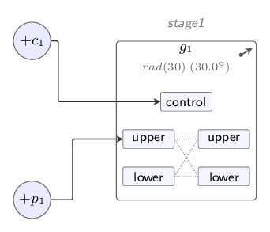
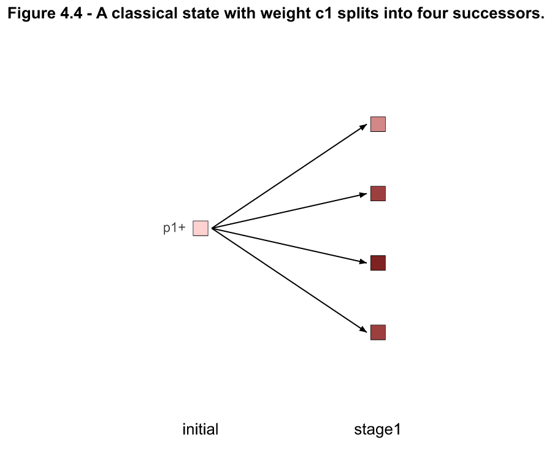

# Quantish Physics

This is a simulation of "quantish" physics, as described in Chapter 4 of *Good and
Real: Demystifying Paradoxes from Physics to Ethics* (Gary L. Drescher, MIT
Press, 2006). The quantish universe is a toy analogue of quantum mechanics, in which
"particles" with complex-valued weights flow through a network of Fredkin
gates, splitting into weighted superpositions of classical states. Every classical state (or _world_) is a point in a configuration space. A configuration space has $2p$ dimensions, where $p$ is the number of particles defined in one specific model. Each quantish particle has, at any moment, a _position_ and a _sign_. We designate a particle's sign as _plus_ or _minus_ (though this could also be thought of as any other two-valued aspect, such as left- or right-handed spin). As described in the book, we can set up models that demonstrate several quantum phenomena, including interference as shown in the classic double-slit experiment, up to the EPR-Bell experiment, in which apparently nonlocal interactions take place, without hidden variables.

Every figure from the chapter is included here as a runnable model, in both the
2006 published numbering (`models/gr2006/`) and the numbering of the 2026
revised draft (`models/gr2026/`); `models/README.md` has the mapping.

With the included apps, you can: load any of the supplied models as a live circuit, run it, and see
  every resulting classical state with its exact weight. Once a model is loaded, you can
  drag a gate's angle slider, run the model again, and see the split probabilities change.
  Running a model also generates a trace how weights evolve through the circuit, step by step.

With a suitable model loaded, you can run the EPR/Bell experiment and compare the quantish results against
  both quantum and classical predictions

Here is the simplest model — the single gate of figure 4.4 — as the app
draws it, and its weight-evolution graph after a run:





To get started with a. gentle introduction, follow the installation instructions below, then go to  [Quick Start](#quick-start).

## Installation

This simulation requires Python 3.13+. [uv](https://docs.astral.sh/uv/) is highly recommended for running the included apps, which are implemented as [Marimo](https://marimo.io/) notebooks.

Once you have uv and Python installed, run these commands:

```bash
git clone https://github.com/rgobbel/quantish.git
cd quantish
```
then

```bash
uv sync
```

Or, using `pip` in a fresh virtual environment:

```bash
pip install -e .
```

### External tools for the circuit diagrams

The TikZ circuit diagrams are rendered with `pdflatex` and converted with `pdf2svg`. Without
them the apps still run, but the diagram panels show a "render
unavailable" note instead. The LaTeX install must include TikZ/PGF and
the `standalone` document class.

To install TikZ:

- On Debian/Ubuntu (including Jetson boards):
  - `sudo apt install texlive-latex-base texlive-latex-extra
  texlive-fonts-recommended texlive-fonts-extra pdf2svg`
  - the command above is verified to work. `texlive-latex-base` + `pdf2svg` alone is
  not enough
- On macOS:
  1. Install MacTeX (large!) and Homebrew
  2. `sudo tlmgr install standalone`
  3. `brew install pdf2svg`

Also optional, but highly recommended:

- ImageMagick (`magick`) — to export TikZ diagrams from the CLI to PNG files
- `mmdc` (mermaid-cli) — to render Mermaid diagrams to SVG/PDF from the CLI

## Running the interactive apps

To see implementations of the full set of figures from the book:

```bash
uv run marimo run notebooks/quantish_app.py
```

This will open a [marimo](https://marimo.io) notebook app, allowing you choose a model and gate angles,
run the model, and explore the results, including circuit diagrams implemented with TikZ and Mermaid, tables showing numeric results, plus a few other demos:
- a way to run a model using Monte Carlo sampling to collect classical-world statistics
- an interactive weight-split explorer to clarify the effect of weight-splitting in quantish gates
- and (for networks that model the full EPR setup) a simulaton of a full Bell/CHSH sweep, comparing observed values with analytically-derived expected values from a quantum world, as well as expected values from classical non-quantum physics

There is also a demonstration of the classic [double-slit experiment](https://en.wikipedia.org/wiki/Double-slit_experiment) implemented in the quantish framework:

```bash
uv run marimo run notebooks/double_slit_app.py
```
Either of these notebooks can also be run using `marimo edit` in place of `marimo run`, to allow viewing and editing of the code.


## Quick Start

### To run the main app:

   ```bash
   uv run marimo run notebooks/quantish_app.py
   ```

   A browser tab will open.

The simplest model is already selected: **fig4.04** — a single Fredkin
   gate, straight from figure 4.4 of the book, with particle _p1_ on the
   gate's upper switch wire and a zero-weight particle _c1_ on its
   control wire.

Press **▶ Run simulation**.
Results are initially hidden. Click on any results heading to see its content.

### What you should see, for the circuit of figure 4.4:
   - **TikZ Circuit Diagram**: the circuit diagram, drawn from the model itself;
   - **Mermaid circuit diagram including weight values**: another circuit diagram, generated by the Mermaid graphing package, including numerical values for the information passing through the network
   - **Weight evolution graphic**: A graphical trace of network weights as they propagate through the network
   - **Weight evolution table**: A numerical table detailing the evolution of network weights.
   - **Final configuration-space points**: the four "classical worlds"
     the gate splits _p1_'s the initial weight into, each with its exact weight;
   - **Marginal probabilities**: how likely _p1_ is to land at each
     gate output.

Now drag _**g1**_'s angle slider and press **▶ Run simulation** again:
   the split probabilities follow the angle (cos²θ against sin²θ,
   trading places as you sweep it).

All of the book's circuits are instantiated as models that can be run in this app.
   You can follow along as you read the book, loading and running the model corresponding
   to each of the Chapter 4 figures.

## Command-line interface

The models can also be run from a command line. For example:

```bash
uv run quantish -c fig4.17            # the EPR experiment (2026 revised edition numbering)
uv run quantish -c fig4.13 --symbolic # exact symbolic weights
uv run quantish -c fig4.16 --config-sub gr2006   # from the 2006 model set
```

Some useful options (see `--help` for the full list):

- `--symbolic` / `--numeric` — exact SymPy math vs. floating point
- `--diagram-when both` — Mermaid diagrams before and after the run
- `--tikz-diagram pdf|svg|png` — render the TikZ circuit diagram
- `--sample --n-samples N` — Monte Carlo sampling of outcomes
- `--epr-stats` — the Bell/CHSH sweep on an EPR model
- `--set NAME=EXPR` — override a model variable, e.g. `--set theta2=pi/8`
- `--loglevel debug` — a detailed trace of every gate firing and
  configuration-space point split, with checkable weight arithmetic

## Technical details

### Models

A model is a YAML file, containing definitions of particles with initial weights,
Fredkin gates with
rotation angles, links wiring gate outputs to gate inputs, and explicit `run_stages` specifying the order in which gates will be run, possibly (virtually) simultaneously.
`models/defaults.yaml` supplies shared settings. `models/gr2026` holds models corresponding to the 2026 revision of Chapter 4 of *Good and Real*, `models/gr2006` has models whose numbering corresponds to the 2006 edition of the book, and `models/extras/` holds
circuits not corresponding to any book figure. `models/README.md` documents the
2006/2026 figure correspondence.

#### Beyond the book: gate phases

In this implementation, gates may also declare an optional `phase`.
Every particle traversing the gate has its weight rotated
by e^(iφ) without affecting the magnitude of particles traveling through it.
An angle-0 gate with a phase, entered through its control wire, acts as a *phase plate*
(named for the optics device: a thin transparent plate that delays one
light path, shifting its phase without dimming it). This is an extension
beyond the book's gates, which have only the measurement angle; the
default of 0 leaves every book figure exactly as printed. The double-slit
app uses a phase plate to carry each screen pixel's path-length
difference.

### Tests

There is a test suite. To run it:

```bash
uv run pytest
```

The suite includes golden-state tests: exact final configuration-space point
amplitudes for the book models, verified in both numeric and symbolic modes.
