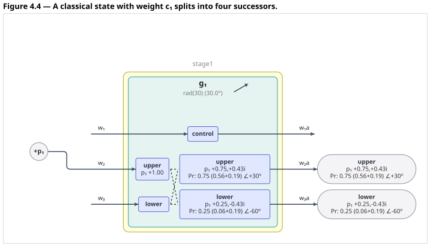
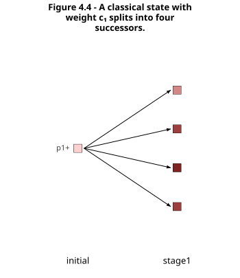

# Quantish Physics

**_Note_: some portions of this refer to an as-yet-unpublished revised edition of _Good and Real._**

This is a simulation of "quantish" physics, as described in Chapter 4 of *Good and
Real: Demystifying Paradoxes from Physics to Ethics* (Gary L. Drescher, MIT
Press, 2006). The quantish universe is a toy analog of quantum mechanics, in which
"particles" with complex-valued weights flow through a network of Fredkin
gates, splitting into weighted superpositions of classical states. Every classical state (or _world_) is a point in a configuration space. A configuration space has $2p$ dimensions, where $p$ is the number of particles defined in one specific model. Each quantish particle has, at any moment, a _position_ and a _sign_. We designate a particle's sign as _plus_ or _minus_ (though this could also be thought of as any other two-valued aspect, such as left- or right-handed spin). As described in the book, we can set up models that demonstrate several quantum phenomena, including interference as shown in the classic double-slit experiment, up to the EPR-Bell experiment, in which apparently nonlocal interactions take place, without hidden variables.

Every figure from the chapter is included here as a runnable model, in both the
2006 published numbering (`models/gr2006/`) and the numbering of the 2026
revised draft (`models/gr2026/`); `models/README.md` has the mapping.

With the included apps, you can: load any of the supplied models as a live circuit, run it, and see
  every resulting classical state with its exact weight. Once a model is loaded, you can
  drag a gate's angle slider, run the model again, and see how the split probabilities change.
  Running a model also generates a trace of weight evolution through the circuit, step by step.

With a suitable model loaded, you can run the EPR/Bell experiment and compare the quantish results against
  both quantum and classical predictions

Here is the simplest model — the single gate of figure 4.4 — as the app
draws it, and its weight-evolution graph after a run:





To get started with a gentle introduction, follow the installation instructions below, then go to  [Quick Start](#quick-start).

## Installation

This simulation requires Python 3.13+. [uv](https://docs.astral.sh/uv/) is highly recommended for running the included apps, which are implemented as [Marimo](https://marimo.io/) notebooks.

Once you have uv and Python installed, run these commands:

```bash
git clone https://github.com/rgobbel/quantish.git
cd quantish
```
then

```bash
uv sync
```

Or, using `pip` in a fresh virtual environment:

```bash
pip install -e .
```

### External tools for optional circuit diagrams (CLI only)

- TikZ

  The command-line interface can generate circuit diagrams using TikZ, suitable for inclusion in
LaTeX documents.

  To install TikZ:

     - On Debian/Ubuntu (including Jetson boards):
       - `sudo apt install texlive-latex-base texlive-latex-extra
  texlive-fonts-recommended texlive-fonts-extra pdf2svg`
       - the command above is verified to work. `texlive-latex-base` + `pdf2svg` alone is
  not enough
     - On macOS:
       1. Install MacTeX (large!) and Homebrew
       2. `sudo tlmgr install standalone`
       3. `brew install pdf2svg`

     - Also optional, but highly recommended for TikZ diagrams on both MacOS and Linux:

       - ImageMagick (`magick`) — to export TikZ diagrams from the CLI to PNG files

- Mermaid

  There is also an option to generate circuit diagrams from the CLI with the Mermaid graphing package.

  The `python-mermaid` package is installed by default. In order to generate SVG and PDF versions
  of Mermaid diagrams, you will need the `mmdc` (mermaid-cli) Node package, which can be installed using `npm` on any system that supports `nodejs`.

## Running the interactive apps

To see implementations of the full set of figures from the book:

```bash
uv run marimo run notebooks/quantish_app.py
```

This will open a [marimo](https://marimo.io) notebook app, including 
  interactive circuit diagrams, tables showing numeric results, and a few other demos:
- a way to run a model using Monte Carlo sampling to collect classical-world statistics, in either of two modes — two interpretations sampling the same wave (see below)
- (for networks that model the full EPR setup) a simulation of a full Bell/CHSH sweep, comparing observed values with analytically-derived expected values from a quantum world, as well as expected values from classical non-quantum physics
- an interactive weight-split explorer to clarify the effect of weight-splitting in quantish gates

There is also a demonstration of the classic [double-slit experiment](https://en.wikipedia.org/wiki/Double-slit_experiment) implemented in the quantish framework:

```bash
uv run marimo run notebooks/double_slit_app.py
```
Either of these notebooks can also be run using `marimo edit` in place of `marimo run`, to allow viewing and editing of the code.

## Browser-only builds (WebAssembly)

Both apps can be compiled into a static web site that runs entirely in
the visitor's browser. The Python engine executes under
[Pyodide](https://pyodide.org/) (WebAssembly), so serving the apps needs
no Python installation, no running server process, and no authentication
— any static file host will do, and nothing a visitor does can execute
code on the host machine.

To build the site:

```bash
tools/build_wasm_app.sh . /path/to/output-dir
```

The script builds a wheel of the `quantish` package, exports both
notebooks with `marimo export html-wasm`, and bundles the wheels and the
model library into the output. The apps land in `quantish_app/` and
`double_slit_app/`, with a landing page at the site root linking to
both. The output includes a small `serve.sh`; to try it locally:

```bash
python3 -m http.server --directory /path/to/output-dir
```

then open `http://localhost:8000/` (the site must be served over HTTP;
opening `index.html` from the filesystem will not work).

A few things are different in the browser-only build:

- The first visit downloads Pyodide and the scientific stack (roughly
  40&nbsp;MB) from public CDNs and takes a minute or two; later visits
  load from the browser cache in seconds.
- The model library is frozen into the site at build time, so the
  **rescan models** button is absent and the app says so; gate angles
  and everything downstream remain fully adjustable.
- Monte Carlo sampling runs synchronously with a progress bar (browser
  Python cannot start threads), so there is no Cancel button.

## Quick Start

### To run the main app:

   ```bash
   uv run marimo run notebooks/quantish_app.py
   ```

   A browser tab will open.

The simplest model is already selected: **fig4.04** — a single Fredkin
   gate, straight from figure 4.4 of the book, with particle _p1_ on the
   gate's upper switch wire.
   A diagram of the network's structure will be displayed below.

Press **▶ Run simulation**.
Run result values are initially hidden. After running the simulation, the network diagram will include
numerical results, and a graph illustrating the flow of weights through the network will be
displayed below it. Remaining results are behind headings.

Click on any results heading to see its content.

### What you should see, for the circuit of figure 4.4:
   - The circuit diagram will now show the values computed by the simulation, as weights flow through the network. Clicking **show values** will toggle between the pure topology diagram and the version that shows results.
   - Under **Detailed Results** are:
     - **Weight evolution table**: A numerical table detailing the evolution of network weights
     - **Final configuration-space points**: the four "classical worlds" that result from
     the split of _p1_'s initial weight
     - **Marginal probabilities**: how likely _p1_ is to land at each
     gate output
     - **Gate inputs and outputs by step**

Now open **Custom Model Parameters**, drag _**g1**_'s angle slider and press **▶ Run simulation** again. The split probabilities will follow the angle (cos²θ against sin²θ,
   trading places as you sweep it).

All of the book's circuits are instantiated as models that can be run in this app.
   You can follow along as you read the book, loading and running the model corresponding
   to each of the Chapter 4 figures.

## Command-line interface

The models can also be run from a command line. For example:

```bash
uv run quantish -c fig4.17            # the EPR experiment (2026 revised edition numbering)
uv run quantish -c fig4.13 --calculation-mode symbolic   # exact symbolic weights
uv run quantish -c fig4.16 --config-sub gr2006   # from the 2006 model set
```

Some useful options (see `--help` for the full list):

- `--calculation-mode symbolic|float` — exact SymPy math vs. floating
  point, overriding the model's own setting
- `--diagram mermaid,tikz,circuit,graph` — which diagrams to draw
  (also `all` / `none`; default `mermaid,graph`)
- `--diagram-format png,svg,pdf` — output formats (default `svg`;
  Mermaid always writes its `.mmd` source as well)
- `--diagram-when both` — circuit diagrams before and/or after the run
- `--sample --n-samples N` — Monte Carlo sampling of outcomes;
  `--mc-mode terminal|pilot|both` picks the interpretation (below);
  `--epr-mode terminal|pilot|hidden` picks the model for the Bell sweep's
  sampled rates
- `--epr-stats` — the Bell/CHSH sweep on an EPR model
- `--qubits` — compile the model to a qubit circuit, draw it, and check
  the circuit's statevector against the engine (see *Quantish as qubits*)
- `--set NAME=EXPR` — override a model variable, e.g. `--set theta2=pi/8`
- `--loglevel debug` — a detailed trace of every gate firing and
  configuration-space point split, with checkable weight arithmetic

## Technical details

### Models

A model is a YAML file, containing definitions of particles with initial weights,
Fredkin gates with
rotation angles, links wiring gate outputs to gate inputs, and explicit `run_stages` specifying the order in which gates will be run, possibly (virtually) simultaneously.
`models/defaults.yaml` supplies shared settings. `models/gr2026` holds models corresponding to the 2026 revision of Chapter 4 of *Good and Real*, `models/gr2006` has models whose numbering corresponds to the 2006 edition of the book, and `models/extras/` holds
circuits not corresponding to any book figure. `models/README.md` documents the
2006/2026 figure correspondence.

#### Beyond the book: gate phases

In this implementation, gates may also declare an optional `phase`.
Every particle traversing the gate has its weight rotated
by e^(iφ) without affecting the magnitude of particles traveling through it.
An angle-0 gate with a phase, entered through its control wire, acts as a *phase plate*
(named for the optics device: a thin transparent plate that delays one
light path, shifting its phase without dimming it). This is an extension
beyond the book's gates, which have only the measurement angle; the
default of 0 leaves every book figure exactly as printed. The double-slit
app uses a phase plate to carry each screen pixel's path-length
difference.

### Monte Carlo: two interpretations of one wave, and a local model

The engine always computes the whole wave — every configuration-space
point with its weight. Monte Carlo sampling then asks what a single run
of the experiment looks like, and the answer depends on the
interpretation, so two samplers are offered on the same models:

- **terminal** draws one final configuration-space point per trial with
  probability |w|². This is the Everettian "which branch am I in"
  sampler, and the faithful simulation of a real experiment: interference
  stays intact until observation and the frequencies converge on the
  exact values.
- **pilot** (de Broglie–Bohm) follows one guided trajectory per trial: a
  single actual configuration advances stage by stage, each stage's
  transition probabilities fitted to the full wave, so at every stage
  the configurations are distributed exactly as |w|². It never
  dead-ends, it matches every prediction, and it is nonlocal — the
  transition probabilities depend on the whole wave, both branches. Discrete
  pilot-wave dynamics are not unique (Bell's 1984 formulation is
  stochastic for that reason; Vink 1993 shows the continuum limit
  recovers Bohm's deterministic guidance); this implementation picks the
  maximum-entropy coupling on the edges of the configuration-space
  graph. The empirical content — walker statistics equal to |w|² at
  every stage — is common to all such choices.
The Bell/CHSH sweep offers a third choice that samples no wave at all:
**hidden**, Bell's local hidden-variable example. Each trial draws one
hidden angle λ uniformly from [0, π) — the model's only randomness, the
variable the source hands to both particles — and each detector then
reads its outcome deterministically from λ and its own angle alone:
sign cos 2(θ − λ). Its discrepancy converges on the linear law
2|θ1 − θ2|/π of the classical grid, which saturates Bell's inequality
and respects the CHSH bound; the quantish wave crosses both. The CLI runs the sweep under one model with
`--epr-mode`; the quantish app's Monte Carlo section and its Bell/CHSH
sweep both let you choose several at once and compare the grids and
verdicts side by side.

### Quantish as qubits

A quantish circuit is a qubit circuit. A particle is two qubits — its
sign (|0⟩ plus, |1⟩ minus) and its position (|0⟩ upper wire, |1⟩
lower) — and a gate at measurement angle θ with no control particle
present is

    U(θ) = Rx(−2θ) on sign · CNOT(sign → position) · Rx(+2θ) on sign

the sign measured in the basis rotated by θ, with the position wire
recording the outcome: the parallel component passes straight, the
perpendicular component crosses over. The four split components of
§4.2.3 are the entries of that rotated CNOT. A control particle present
swaps straight and cross, which is one more NOT on the position,
conditioned on the control particle's position; a phase plate is a
phase conditioned on position; a branching start is a Ry rotation. A
configuration-space point is a computational basis state, its weight
the amplitude, and interference is two paths landing on the same basis
state.

`quantish/qubit_circuit.py` compiles a loaded model into that circuit
(`compile_qubits`), allocating one extra flag qubit per particle
wherever a resting or diverging component would otherwise collide with
a gate's outputs, and simulates it with a small numpy statevector
simulator. `tests/test_qubit_circuit.py` checks every model in
`models/`: the decoded statevector equals the engine's final
configuration-space points to 1e-9. `--qubits` on the CLI logs the
qubit map, a text drawing, and that check for one model. Figure 4.17
compiles to six qubits and twelve two-qubit gates, all Rx and CNOT.
Nothing here needs Qiskit; `QubitCircuit.to_qiskit()` builds a
`QuantumCircuit` when Qiskit is installed, which is how a quantish
circuit reaches a real device.

Two facts follow. The book's gate set is *monomial in the Hadamard
basis*: every gate, seen with every qubit rotated by H, is a
permutation with phases, so a quantish run is one Hadamard sandwich
around reversible classical logic and phases — the IQP family, which
includes Fredkin-gate reversible computation and Bell-violating
correlations but not a mid-circuit Hadamard, so not Shor's algorithm.
A phase plate is diagonal in the computational basis rather than the
Hadamard one, and with phase plates the gate set generates the full
unitary group on two coupled particles: quantish plus phase plates is
universal.

### Tests

There is a test suite. To run it:

```bash
uv run pytest
```

The suite includes golden-state tests: exact final configuration-space point
amplitudes for the book models, verified in both numeric and symbolic modes.
